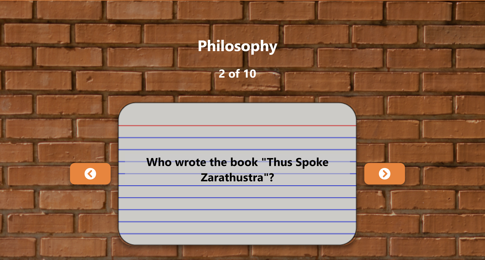

# FlipGPT
<!-- Display image file FlipGPT.png -->

## Inspiration
As scholars and lifelong learners, we are constantly seeking the optimal way to absorb and retain knowledge. While the desire to acquire new information is ever-present, our ability to store it can be fleeting. Inevitably, we may falter on quizzes, forgetting concepts we only just learned. How might we fortify our long-term memory? Psychology suggests that one of the most effective means of bolstering retention is through self-testing. Indeed, this may be why we often find ourselves taking quizzes and exams in educational settings. As corroborated by Ebbinghaus's Forgetting Curve, repetition based on active recall (i.e. the testing effect) enhances long-term retention: https://en.wikipedia.org/wiki/Forgetting_curve#Increasing_rate_of_learning. In light of this, what could be the most potent tool for learning? Flashcards!

Though we recognize the value of the flashcard method, we are cognizant of the challenge of producing appropriate flashcards for the concepts one seeks to learn. For instance, if one wishes to prepare for a quiz or test in a given subject, typing or writing out each flashcard can be exceedingly time-consuming. Similarly, when studying broader concepts, composing a litany of definitions can prove arduous.

We are thrilled to introduce FlipGPT powered by ChatGPT, the preeminent study aid for mastering new concepts.

## What it does
### Login Page

### Loading Page

### Flashcards

### My Study Sets

###
Users may log in to the page, selecting either a topic they wish to study or their notes (e.g. class notes) that they would like to quiz themselves on. After choosing their selection from the drop-down menu, they may enter their input in the prompt box and click the search button. In approximately 30 seconds, FlipGPT will generate all of the requisite flashcards, enabling users to study by flipping through them. To facilitate active recall, users will receive reminders 24 hours, 7 days, 30 days, and 60 days after their last review.

**Video Demo**: https://youtu.be/TPsX6nP22Rk

## How we built it
We employed the following languages and frameworks:
- TypeScript/JavaScript
- React
- Node.js (with express.js)
- IndexedDB

To design the application, we utilized Figma.

In addition, we utilized various APIs, such as `ChatGPTUnofficialProxyAPI` and `TwilioAPI`.

## Challenges we ran into
- Familiarizing ourselves with new frameworks in 24 hours
    - 2 members of our team never used Node.js or React before, learning them was an enriching experience for both team members
- Frontend flashcard animation and functionality
- Parsing user input to generate an effective prompt for AI model
- Database design
    - Originally, we used indexxeddb but decided to migrate to a Node.js server once our project developed.  

## Accomplishments that we're proud of
- Our MVP, which proves highly effective for studying purposes
    - This was built during a 24 hour hack-a-thon (Brickhack 9). Completing this project was an accomplishment in itself.
- Implementation of Twilio to send text message reminders to help students stay on track with studying. 
- We did not sacrafice any of our original ideas - we overcame all challenges presented to us

## What we learned
- Importance of design decisions
- Abstractions of complex ideas into smaller, managable chunks. 
- Many of us had to learn new frameworks (React, JavaScript, Node.js) and how to interface with various APIs (`ChatGPTUnofficialProxyAPI`, `TwilioAPI`).

## What's next for FlipGPT
- Implementation of an SQL or NoSQL database
- Integration of the official Open AI API once we amass a sufficient number of users
- Domain Registration
- Inclusion of an email reminder option (alongside text reminders)
- Incorporation of functionality for scanning PDF or image files and generating flashcards
- More learning tools such as AI Tutor on specific subjects.
- Subscription model for pricing!
- Mobile app

## Contributors
- [Ryan Current](https://github.com/Ryan-Current) - Database Lead / Backend / Frontend
- [Ben Sippel](https://github.com/brs6412) - Database / Twilio API Lead / Frontend
- [James Oh](https://github.com/jamesoh3928) - AI / Backend / Product Manager
- [Colin Tondreau](https://github.com/CTB333) - Frontend Lead / UI/UX Designer